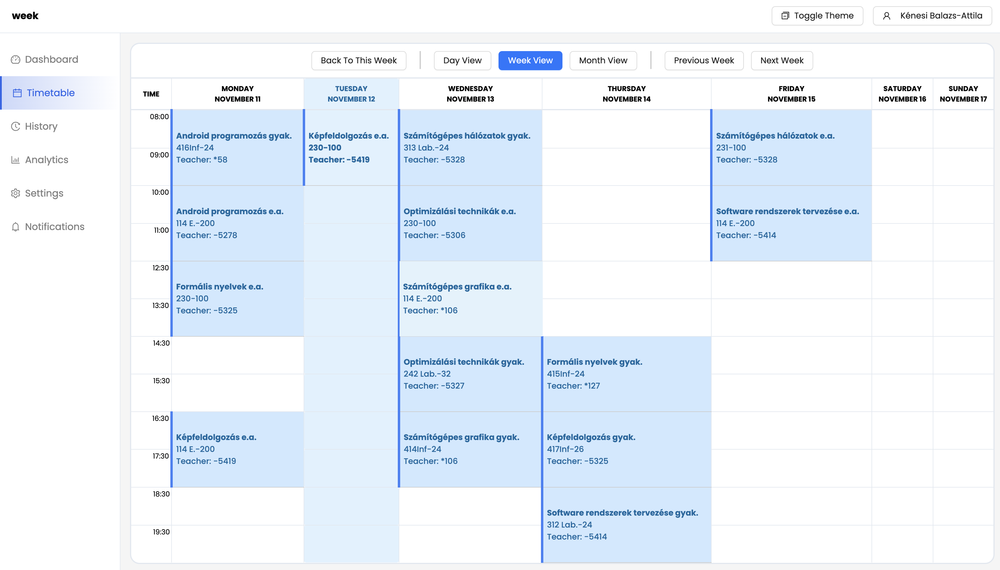

## Államvizsga dolgozat
## Automatic attendance tracking in didactical environment

# Occasion API Endpoints

## Table of Contents
- [Get Occasion by Group ID](#get-occasion-by-group-id)
- [Fetch Occasions by IDs](#fetch-occasions-by-ids)
- [Get Occasion by Subject ID](#get-occasion-by-subject-id)
- [Add Comment to Existing Occasion](#add-comment-to-existing-occasion)
- [Get Occasions Excluding Time Periods](#get-occasions-excluding-time-periods)

---

## Fetch Occasions by IDs
Fetch a list of occasions based on an array of occasion IDs.

- **URL:** `/occasions/ids`
- **Method:** `POST`
- **Body:** 
  - JSON array of occasion IDs, e.g., `{ "ids": ["id1", "id2", "id3"] }`
- **Response:** `200 OK` with a JSON array of occasions matching the provided IDs.

## Web Timetable WeekView

### Screenshot

